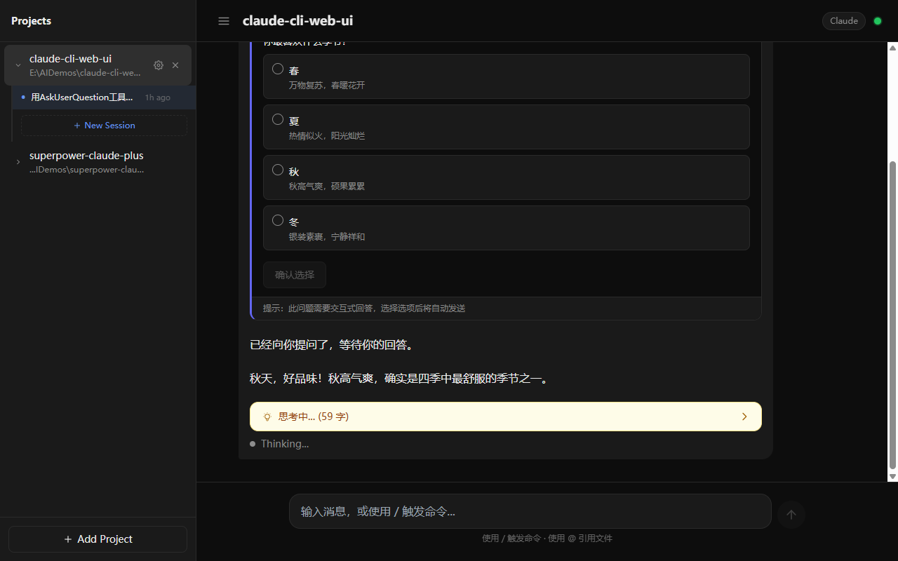
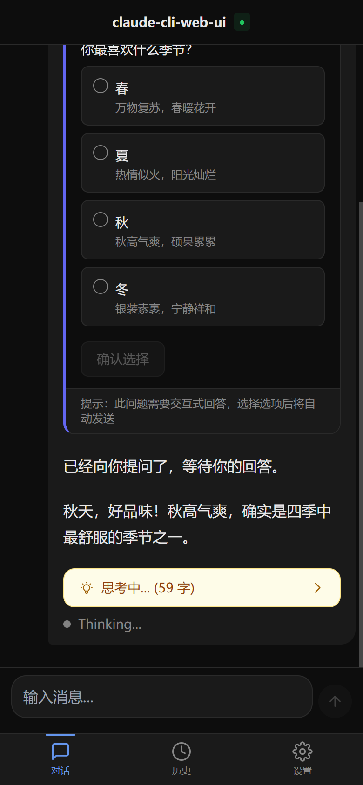
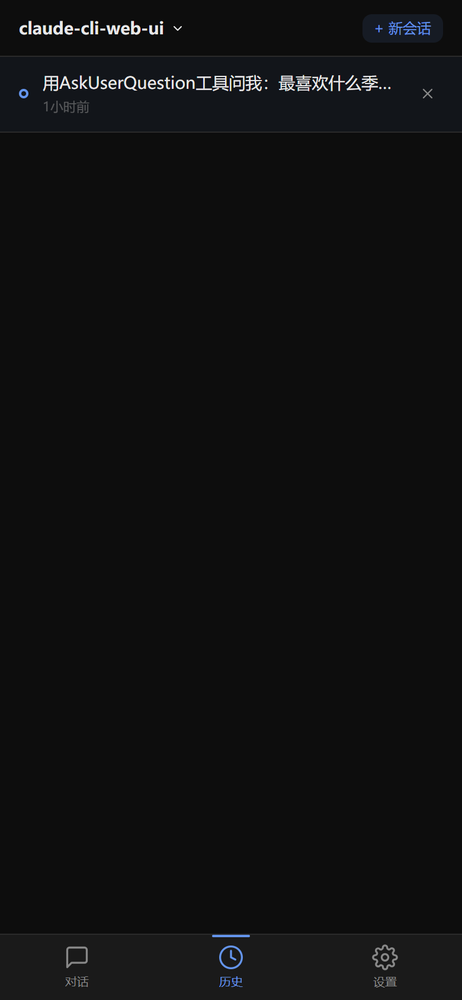
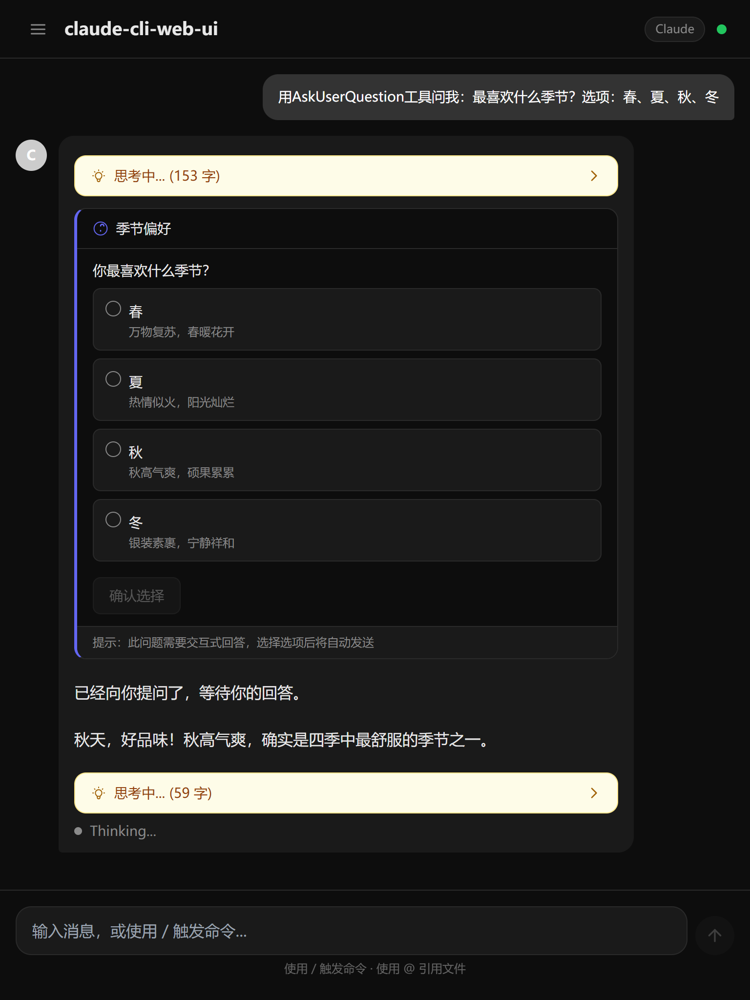
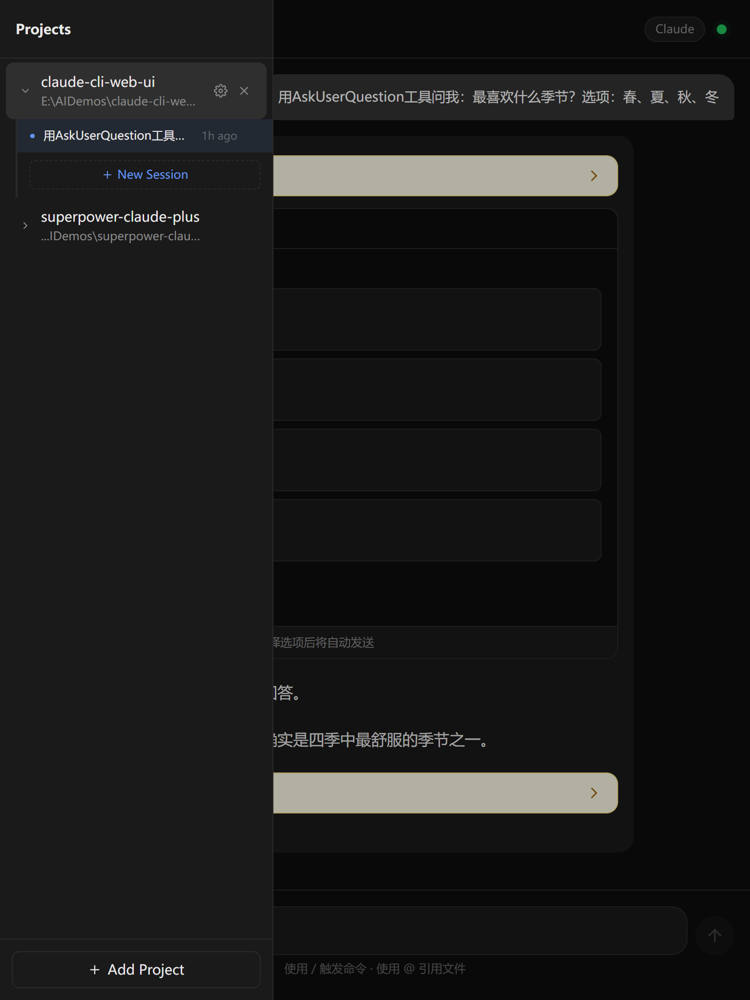

# Claude CLI Web UI

A web interface for interactive conversations with [Claude CLI](https://docs.anthropic.com/en/docs/claude-code) in the browser. Built with Next.js 14, it spawns Claude CLI as a child process and streams responses in real time via SSE.

**English** | [中文](#中文说明)

## Features

- **Real-time streaming** — SSE-based streaming with tool cards, thinking blocks, and interactive question cards
- **Multi-project management** — Add, edit, delete projects; each project has isolated sessions
- **Session history** — Auto-save conversations with resume support (`--resume`)
- **Command palette** — Type `/` to invoke skills/commands, `@` to reference files or URLs
- **File & URL references** — `@file` injects file content, `@url` fetches web content into prompts
- **Interactive Q&A** — Full AskUserQuestion support with option cards (single/multi select)
- **Background processes** — Switch projects without interrupting running Claude CLI processes
- **Responsive design** — Three adaptive layouts: desktop sidebar, tablet drawer, mobile bottom nav
- **LAN access** — Bind to `0.0.0.0` for access from phones and tablets on local network

## Screenshots

### Desktop



### Mobile

 

### Tablet

 

## Prerequisites

- **Node.js** >= 18
- **pnpm** >= 8
- **Claude CLI** installed and authenticated (`claude --version` works)

## Getting Started

```bash
# Install dependencies
pnpm install

# Start dev server (http://localhost:6523)
pnpm dev

# Build for production
pnpm build
pnpm start
```

Open `http://localhost:6523` in your browser. On first launch, add a project by specifying its local path.

To access from other devices on your LAN, use `http://<your-ip>:6523`.

## Configuration

Environment variables are set in `.env.local`:

| Variable | Default | Description |
|----------|---------|-------------|
| `CLAUDE_BIN` | `claude` | Path to Claude CLI executable |
| `DEFAULT_MODEL` | `claude-sonnet-4-6` | Default model for conversations |
| `DEFAULT_CWD` | `process.cwd()` | Default working directory |
| `PORT` | `6523` | Server port |

## Architecture

```
User Input
    ↓
POST /api/chat (spawn Claude CLI with --output-format stream-json)
    ↓
stdin (JSONL user message) → Claude CLI → stdout (JSONL events)
    ↓
SSE /api/runs/{id}/events → Client reads via ReadableStream
    ↓
claude-stream.ts parses events → UI renders in real time
```

**Key design decisions:**

- **Hook layer** — State logic extracted into `useChatSession`, `useProjectList`, `useSessionList`, `useBreakpoint` hooks, shared across desktop/tablet/mobile layouts
- **Background runs** — Active Claude processes stored in a `Map`, allowing project switching without interrupting running tasks
- **Bidirectional stdin/stdout** — `--input-format stream-json` enables AskUserQuestion answers to be sent back via stdin
- **Session persistence** — Conversations saved as JSON files (`data/sessions/{projectId}/`), auto-evicted at 20 sessions per project

## Project Structure

```
app/
  api/           — Backend routes (chat, commands, files, projects, runs, sessions)
  page.tsx       — Entry point (breakpoint-based layout switching)
components/
  ChatPanel.tsx  — Desktop layout (thin UI orchestration ~270 lines)
  CommandPalette.tsx, Sidebar.tsx, MessageList.tsx, ...
  mobile/        — Mobile components (BottomNavBar, MobileLayout, ...)
  tablet/        — Tablet components (TabletLayout with drawer sidebar)
hooks/
  useBreakpoint.ts    — Responsive breakpoint detection
  useChatSession.ts   — Chat state, SSE streaming, background runs
  useProjectList.ts   — Project CRUD + persistence
  useSessionList.ts   — Session list management
lib/
  claude-stream.ts    — stream-json parser
  command-discovery.ts — File system skill/command scanner
  sessions.ts, projects.ts, ...
```

## Tech Stack

- **Framework**: Next.js 14 (App Router)
- **UI**: React 18 + TypeScript + Tailwind CSS
- **Command palette**: [cmdk](https://cmdk.paco.me/)
- **Markdown**: react-markdown + remark-gfm
- **Runtime**: Claude CLI (child_process)

## License

MIT

---

<a id="中文说明"></a>

## 中文说明

一个基于 Next.js 14 的 Web 界面，用于在浏览器中与 Claude CLI 进行交互式对话。通过 spawn Claude CLI 子进程并解析 stream-json 输出，实现实时流式响应。

### 功能亮点

- **实时流式对话** — SSE 流式通信，支持工具卡片、思考块、交互式问答卡片
- **多项目管理** — 添加、编辑、删除项目，每个项目独立会话
- **会话历史** — 自动保存对话，支持 `--resume` 续接上下文
- **命令面板** — `/` 触发技能/命令，`@` 引用文件或 URL
- **文件引用** — `@file` 注入文件内容，`@url` 抓取网页内容到 prompt
- **交互式问答** — 完整支持 AskUserQuestion，单选/多选卡片
- **后台进程** — 切换项目不中断正在运行的 Claude CLI 进程
- **响应式布局** — 桌面侧边栏、平板抽屉、手机底部导航三种自适应布局
- **局域网访问** — 绑定 `0.0.0.0`，支持手机/平板通过局域网 IP 访问

### 快速开始

```bash
pnpm install
pnpm dev        # 启动 http://localhost:6523
```

### 技术栈

Next.js 14 (App Router) + React 18 + TypeScript + Tailwind CSS + cmdk + react-markdown
